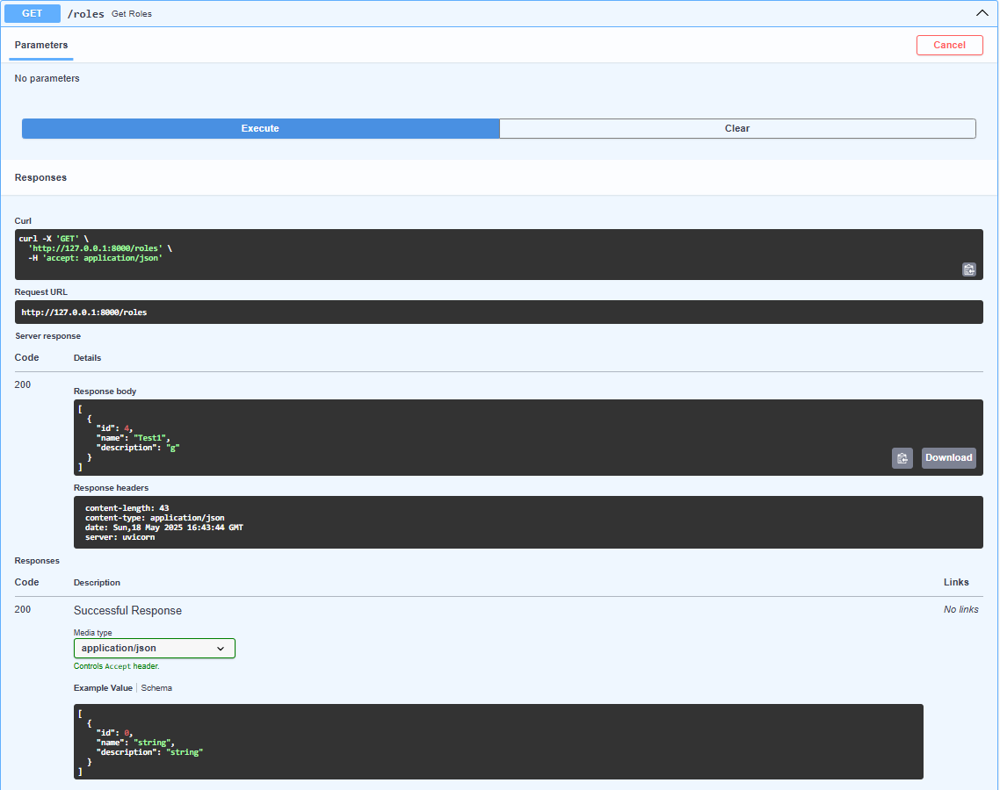

# Тестування працездатності системи

## Опис FastAPI-проєкту для RESTful сервісу опитувань
### 1. Встановлення бібліотек


```python
python -m venv venv
venv\Scripts\activate
```
### Встановлення необхідних залежностей:
```python
pip install fastapi uvicorn sqlalchemy pydantic
```
### 2. Структура проєкту
```python
project/
│
├── main.py              
├── models.py            
├── schemas.py          
├── database.py          
├── requirements.txt     
```
### 3. Налаштування бази даних (database.py)
```python
from sqlalchemy import create_engine
from sqlalchemy.orm import sessionmaker

DB_URL = "mysql+pymysql://root:(тут пароль, але я його не засвічу вам)@localhost/mydb"

engine = create_engine(DB_URL, echo=True)
SessionLocal = sessionmaker(bind=engine, autoflush=False, autocommit=False)
```
### 4. SQLAlchemy моделі (models.py)
```python
from sqlalchemy import Column, Integer, String, ForeignKey, DateTime, BLOB
from sqlalchemy.orm import relationship, declarative_base

Base = declarative_base()

class Role(Base):
    __tablename__ = "role"
    id = Column(Integer, primary_key=True)
    name = Column(String(50), nullable=False)
    description = Column(String(100))


class User(Base):
    __tablename__ = "user"
    id = Column(Integer, primary_key=True)
    picture = Column(BLOB)
    created_at = Column(DateTime)
    updated_at = Column(DateTime)
    email = Column(String(100), nullable=False)
    password = Column(String(100), nullable=False)
    name = Column(String(50), nullable=False)
    surname = Column(String(50), nullable=False)
    nickname = Column(String(50), nullable=False)

    quizzes = relationship("Quiz", back_populates="user")
    user_roles = relationship("UserRole", back_populates="user")
    user_expertises = relationship("UserExpertise", back_populates="user")
    sessions = relationship("SurveySession", back_populates="user")


class UserRole(Base):
    __tablename__ = "userrole"
    user_id = Column(Integer, ForeignKey("user.id"), primary_key=True)
    role_id = Column(Integer, ForeignKey("role.id"), primary_key=True)

    user = relationship("User", back_populates="user_roles")
    role = relationship("Role")


class ExpertiseCategory(Base):
    __tablename__ = "expertisecategory"
    id = Column(Integer, primary_key=True)
    name = Column(String(50))
    description = Column(String(100))


class UserExpertise(Base):
    __tablename__ = "userexpertise"
    expertisecategory_id = Column(Integer, ForeignKey("expertisecategory.id"), primary_key=True)
    user_id = Column(Integer, ForeignKey("user.id"), primary_key=True)

    user = relationship("User", back_populates="user_expertises")
    expertise = relationship("ExpertiseCategory")


class Quiz(Base):
    __tablename__ = "quiz"
    id = Column(Integer, primary_key=True)
    created_by = Column(Integer)
    created_at = Column(DateTime)
    updated_at = Column(DateTime)
    name = Column(String(100))
    description = Column(String(255))
    user_id = Column(Integer, ForeignKey("user.id"))

    user = relationship("User", back_populates="quizzes")
    questions = relationship("Question", back_populates="quiz")
    sessions = relationship("SurveySession", back_populates="quiz")


class Question(Base):
    __tablename__ = "question"
    id = Column(Integer, primary_key=True)
    quiz_id = Column(Integer, ForeignKey("quiz.id"))
    number = Column(Integer)
    description = Column(String(255))
    type = Column(String(45))

    quiz = relationship("Quiz", back_populates="questions")
    options = relationship("Option", back_populates="question")
    answers = relationship("Answer", back_populates="question")


class Option(Base):
    __tablename__ = "option"
    id = Column(Integer, primary_key=True)
    question_id = Column(Integer, ForeignKey("question.id"))
    number = Column(Integer)
    description = Column(String(255))

    question = relationship("Question", back_populates="options")
    selected_options = relationship("SelectedOption", back_populates="option")


class SurveySession(Base):
    __tablename__ = "surveysession"
    id = Column(Integer, primary_key=True)
    user_id = Column(Integer, ForeignKey("user.id"))
    quiz_id = Column(Integer, ForeignKey("quiz.id"))
    started_at = Column(DateTime)
    completed_at = Column(DateTime)
    status = Column(String(45))

    user = relationship("User", back_populates="sessions")
    quiz = relationship("Quiz", back_populates="sessions")
    answers = relationship("Answer", back_populates="session")


class Answer(Base):
    __tablename__ = "answer"
    id = Column(Integer, primary_key=True)
    surveysession_id = Column(Integer, ForeignKey("surveysession.id"))
    question_id = Column(Integer, ForeignKey("question.id"))
    file = Column(BLOB)
    text = Column(String(255))

    question = relationship("Question", back_populates="answers")
    session = relationship("SurveySession", back_populates="answers")
    selected_options = relationship("SelectedOption", back_populates="answer")


class SelectedOption(Base):
    __tablename__ = "selectedoption"
    answer_id = Column(Integer, ForeignKey("answer.id"), primary_key=True)
    option_id = Column(Integer, ForeignKey("option.id"), primary_key=True)

    answer = relationship("Answer", back_populates="selected_options")
    option = relationship("Option", back_populates="selected_options")

```
### 5. Pydantic-схеми (schemas.py)
```python
from pydantic import BaseModel
from typing import Optional
from datetime import datetime

class RoleBase(BaseModel):
    id: int
    name: str
    description: Optional[str] = None

class RoleCreate(RoleBase):
    pass

class RoleOut(RoleBase):
    id: int
    class Config:
        from_attributes = True

class UserBase(BaseModel):
    email: str
    password: str
    name: str
    surname: str
    nickname: str

class UserCreate(UserBase):
    pass

class UserOut(UserBase):
    id: int
    created_at: Optional[datetime]
    updated_at: Optional[datetime]

    class Config:
        from_attributes = True
```
### 6. Реалізація FastAPI застосунку (main.py) реалізував тільки для Role та User для перевірки працездатності
```python
from fastapi import FastAPI, Depends, HTTPException
from sqlalchemy.orm import Session
from database import SessionLocal, engine
import models
import schemas
from datetime import datetime

models.Base.metadata.create_all(bind=engine)
app = FastAPI(title="Expert Survey API", version="1.0")

def get_db():
    db = SessionLocal()
    try:
        yield db
    finally:
        db.close()


# --- ROLE endpoints ---
@app.post("/roles", response_model=schemas.RoleOut)
def create_role(role: schemas.RoleCreate, db: Session = Depends(get_db)):
    db_role = models.Role(id=role.id, name=role.name, description=role.description)
    db.add(db_role)
    db.commit()
    db.refresh(db_role)
    return db_role

@app.get("/roles", response_model=list[schemas.RoleOut])
def get_roles(db: Session = Depends(get_db)):
    return db.query(models.Role).all()

# --- USER endpoints ---
@app.post("/users", response_model=schemas.UserOut)
def create_user(user: schemas.UserCreate, db: Session = Depends(get_db)):
    db_user = models.User(
        email=user.email,
        password=user.password,
        name=user.name,
        surname=user.surname,
        nickname=user.nickname,
        created_at=datetime.utcnow(),
        updated_at=datetime.utcnow(),
    )
    db.add(db_user)
    db.commit()
    db.refresh(db_user)
    return db_user

@app.get("/users", response_model=list[schemas.UserOut])
def get_users(db: Session = Depends(get_db)):
    return db.query(models.User).all()
```

### 7. Запуск сервера
```python
uvicorn main:app --reload
```

### 8. Під'єднання до БД
```python
2025-05-18 18:58:38,511 INFO sqlalchemy.engine.Engine SELECT DATABASE()
2025-05-18 18:58:38,511 INFO sqlalchemy.engine.Engine [raw sql] {}
2025-05-18 18:58:38,512 INFO sqlalchemy.engine.Engine SELECT @@sql_mode
2025-05-18 18:58:38,512 INFO sqlalchemy.engine.Engine [raw sql] {}
2025-05-18 18:58:38,512 INFO sqlalchemy.engine.Engine SELECT @@lower_case_table_names
2025-05-18 18:58:38,512 INFO sqlalchemy.engine.Engine [raw sql] {}
2025-05-18 18:58:38,514 INFO sqlalchemy.engine.Engine BEGIN (implicit)
2025-05-18 18:58:38,514 INFO sqlalchemy.engine.Engine DESCRIBE `mydb`.`role`
2025-05-18 18:58:38,514 INFO sqlalchemy.engine.Engine [raw sql] {}
2025-05-18 18:58:38,516 INFO sqlalchemy.engine.Engine DESCRIBE `mydb`.`user`
2025-05-18 18:58:38,516 INFO sqlalchemy.engine.Engine [raw sql] {}
2025-05-18 18:58:38,517 INFO sqlalchemy.engine.Engine DESCRIBE `mydb`.`userrole`
2025-05-18 18:58:38,517 INFO sqlalchemy.engine.Engine [raw sql] {}
2025-05-18 18:58:38,517 INFO sqlalchemy.engine.Engine DESCRIBE `mydb`.`expertisecategory`
2025-05-18 18:58:38,517 INFO sqlalchemy.engine.Engine [raw sql] {}
2025-05-18 18:58:38,518 INFO sqlalchemy.engine.Engine DESCRIBE `mydb`.`userexpertise`
2025-05-18 18:58:38,518 INFO sqlalchemy.engine.Engine [raw sql] {}
2025-05-18 18:58:38,519 INFO sqlalchemy.engine.Engine DESCRIBE `mydb`.`quiz`
2025-05-18 18:58:38,519 INFO sqlalchemy.engine.Engine [raw sql] {}
2025-05-18 18:58:38,520 INFO sqlalchemy.engine.Engine DESCRIBE `mydb`.`question`
2025-05-18 18:58:38,520 INFO sqlalchemy.engine.Engine [raw sql] {}
2025-05-18 18:58:38,520 INFO sqlalchemy.engine.Engine DESCRIBE `mydb`.`option`
2025-05-18 18:58:38,520 INFO sqlalchemy.engine.Engine [raw sql] {}
2025-05-18 18:58:38,521 INFO sqlalchemy.engine.Engine DESCRIBE `mydb`.`surveysession`
2025-05-18 18:58:38,521 INFO sqlalchemy.engine.Engine [raw sql] {}
2025-05-18 18:58:38,522 INFO sqlalchemy.engine.Engine DESCRIBE `mydb`.`answer`
2025-05-18 18:58:38,522 INFO sqlalchemy.engine.Engine [raw sql] {}
2025-05-18 18:58:38,523 INFO sqlalchemy.engine.Engine DESCRIBE `mydb`.`selectedoption`
2025-05-18 18:58:38,523 INFO sqlalchemy.engine.Engine [raw sql] {}
2025-05-18 18:58:38,524 INFO sqlalchemy.engine.Engine COMMIT

Process finished with exit code 0
```
### 9. Використання API (POST та GET) та перевірка в Swagger UI


### POST
```json
{
  "id": 4,
  "name": "Test1",
  "description": "g"
}
```


### GET


## Висновок
У результаті виконання лабораторної роботи було отримано практичний досвід повного циклу розробки програмного забезпечення: від аналізу вимог і побудови бізнес-моделей до створення структури бази даних та реалізації доступу до неї за допомогою DAO-шару. Робота з MySQL та Oracle SQL Developer дозволила закріпити знання про особливості реляційних СУБД. Реалізація та тестування програмної інфраструктури засвідчили правильність обраних рішень і відповідність системи сучасним підходам до розробки. Отримані навички можуть бути безпосередньо застосовані при створенні масштабованих та надійних інформаційних систем.


